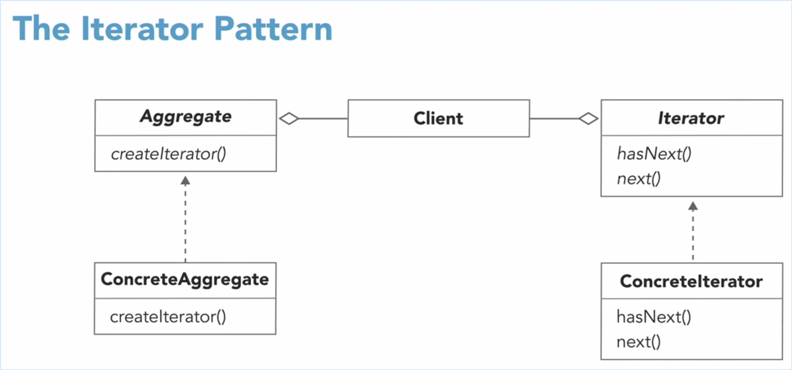
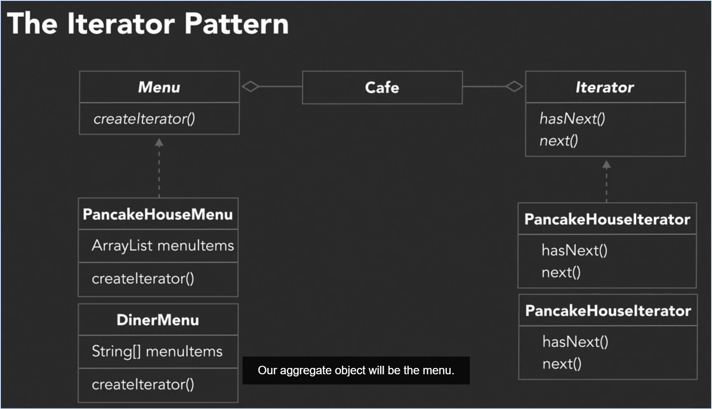

#Iterator Design Pattern

The Iterator Pattern provides a way to access the elements of an aggregate object sequentially without exposing its
underlying representation.

Most collections store their elements in simple lists. However, some of them are based on stacks, trees, graphs and other
complex data structures.

Whatever it is, we must provide some way of accessing the items in the collections, there must be a way to 
go through each item in the collections without accessing them over and over.

_The Single Responsibility Principle: A class should have only one reason to change._

