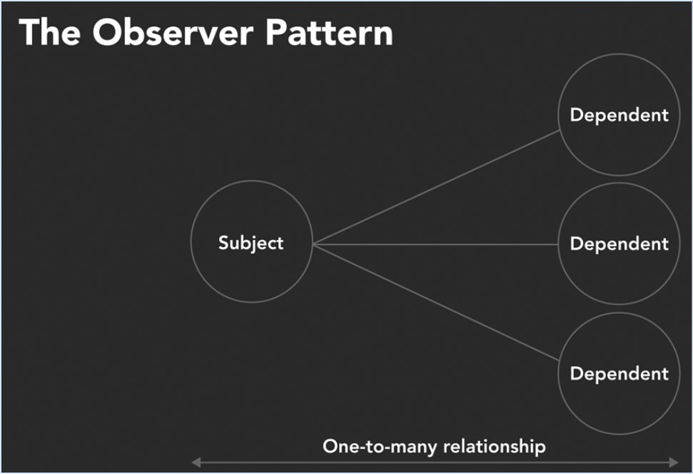
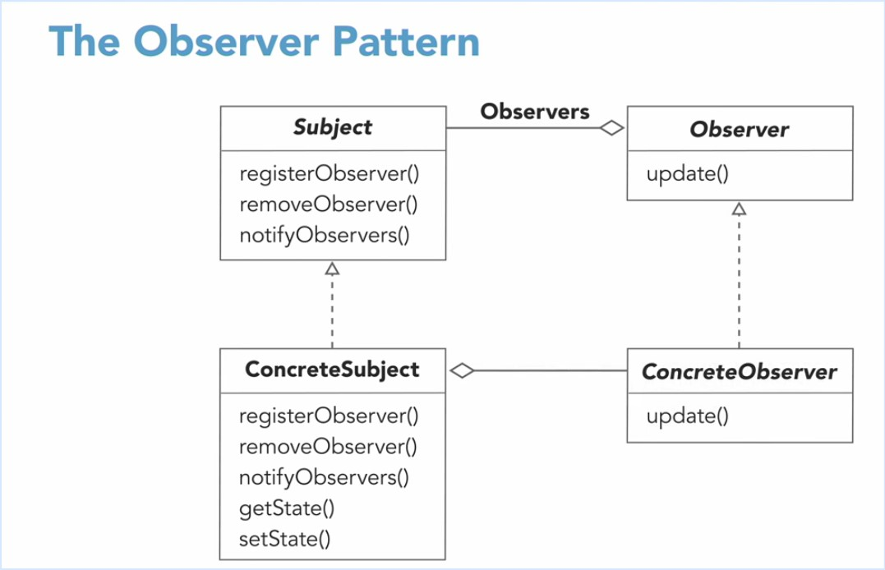
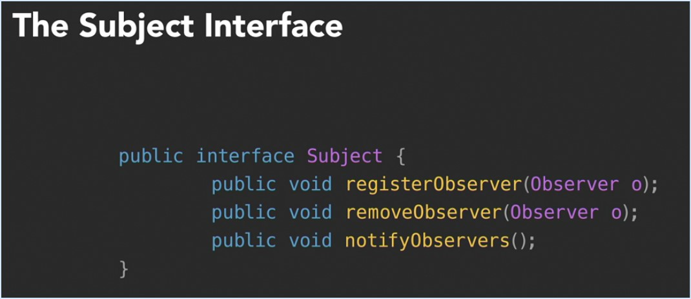
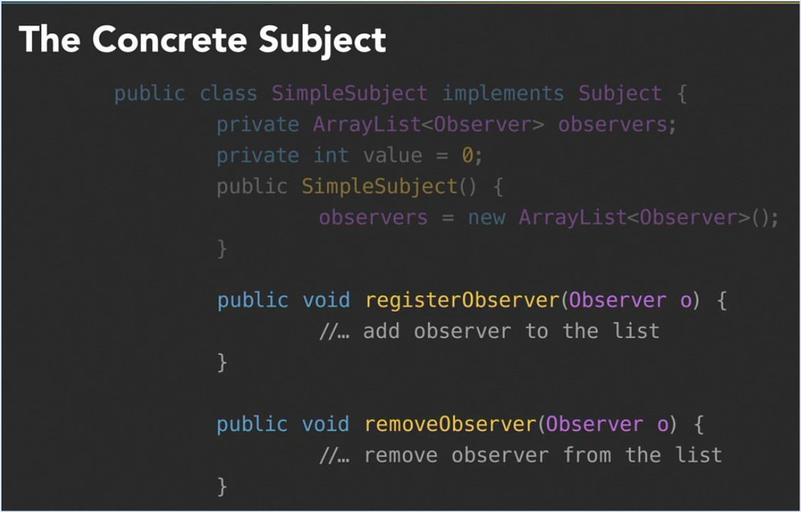
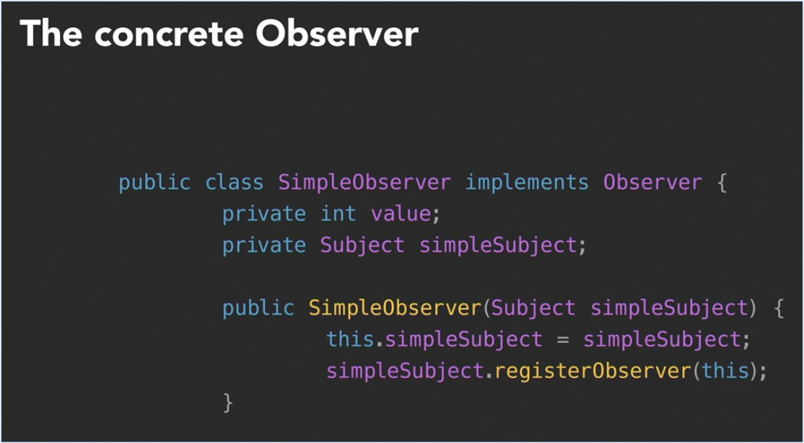
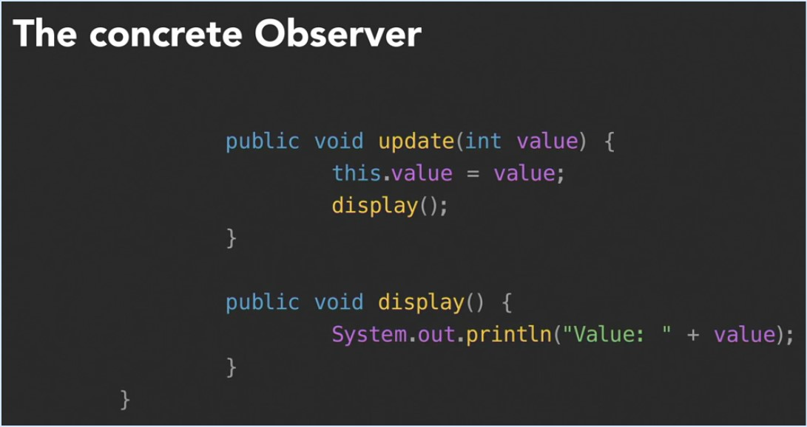
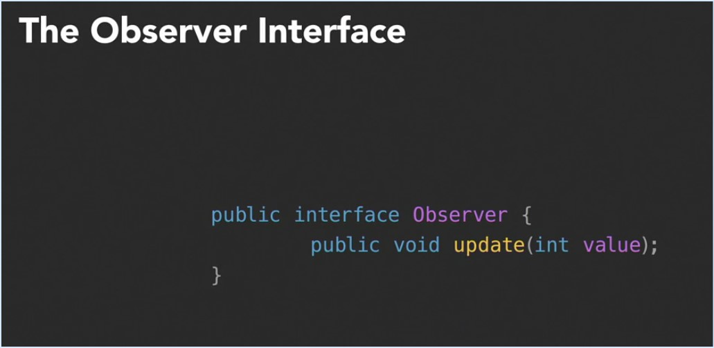

#Observer pattern

_Loose coupling_ between objects.

Minimize the complexity of scenarios, used in many lib and frameworks.

```
This pattern defines a one-to-many dependency between objects so that when one object changes state,
all of its dependents are notified and updated automatically.
```



The dependents are called Observers.









