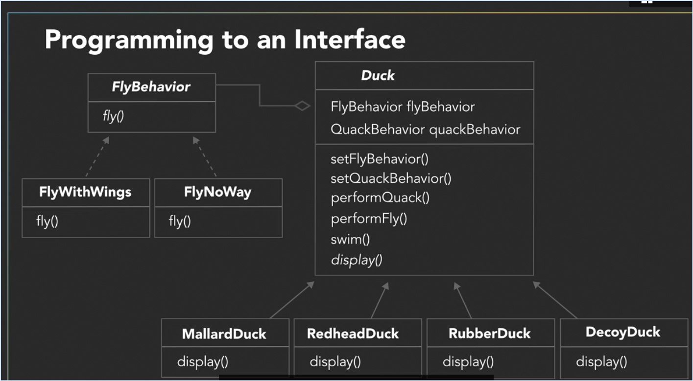

#Strategy Pattern

The strategy pattern defines a family of algorithms, encapsulates each one, and makes them interchangeable.

_Instead of inheriting behavior like the IN-SA relationship, the HAS-A composes the begavior._

Q. When working with inheritance, which kind of relationship do you have with classes?
A. Classes share an IS-A relationship.

Q. What does abstract mean in inheritance when working with subclasses?
A. Subclasses must override all abstract methods of its abstract superclass.

Q. What is an interface, and how is it used in design patters?
A. Design patterns use interfaces to define methods an object must have to be considered a particular type.

Q. When working with design principles, which of the following defines "Encapsulate What Varies"?
A. Once you separate the parts that are changing, you can then modify those parts without affecting the rest 
of the code.

