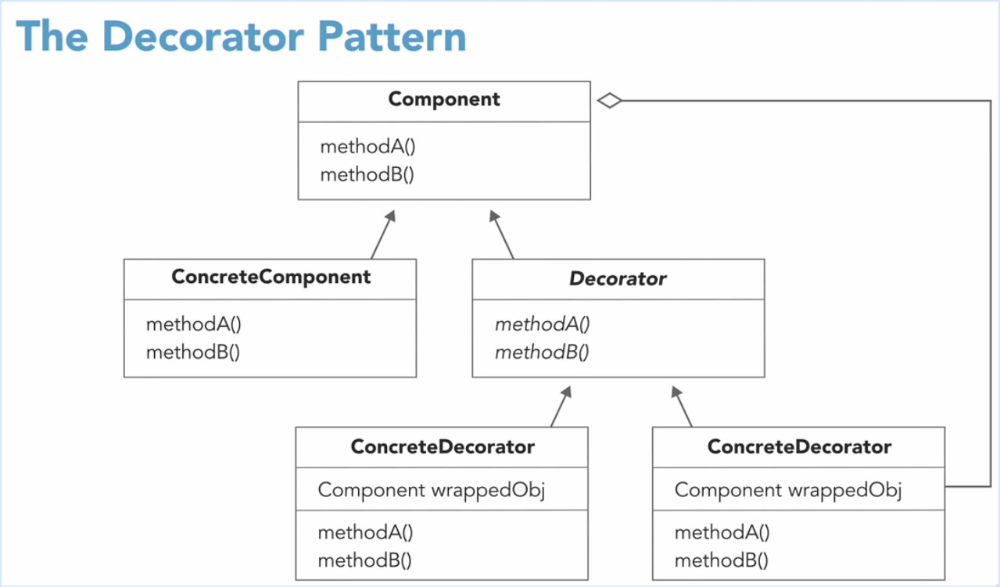
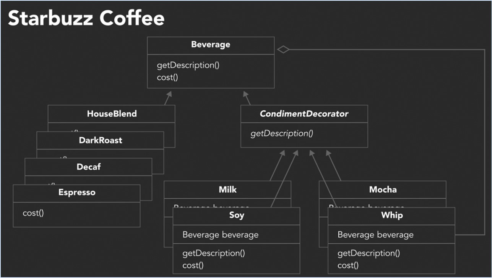
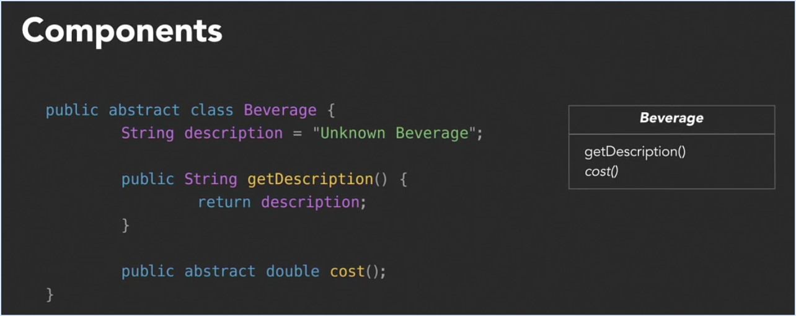
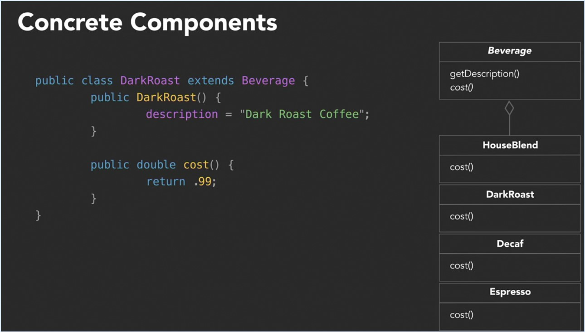
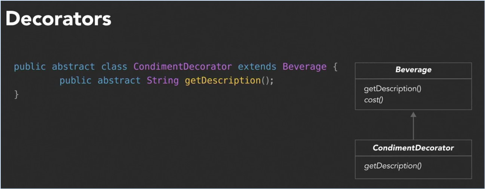
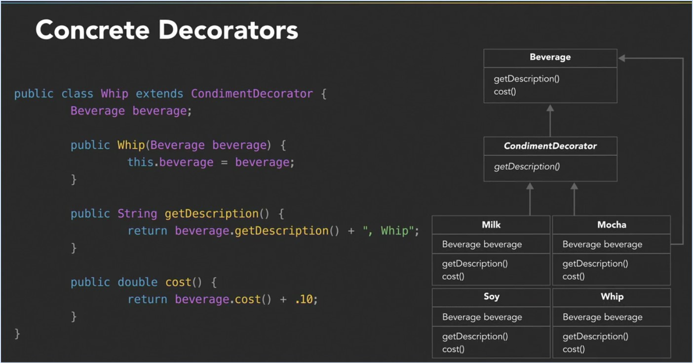
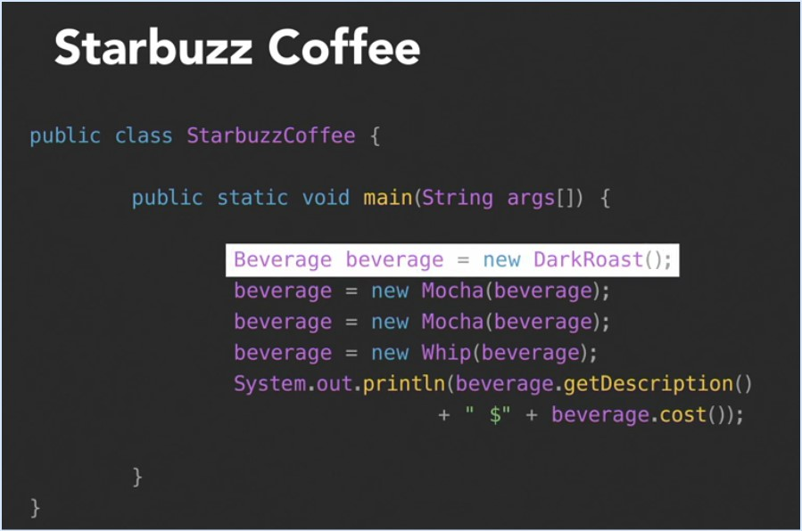

# Decorator Design Pattern

The Open-Closed Principle: Classes should be open for extension but closed for modification.

The decorator pattern attaches additional responsibilities to an object dynamically.
Decorators provide a flexible alternative to subclassing for extending functionality.

