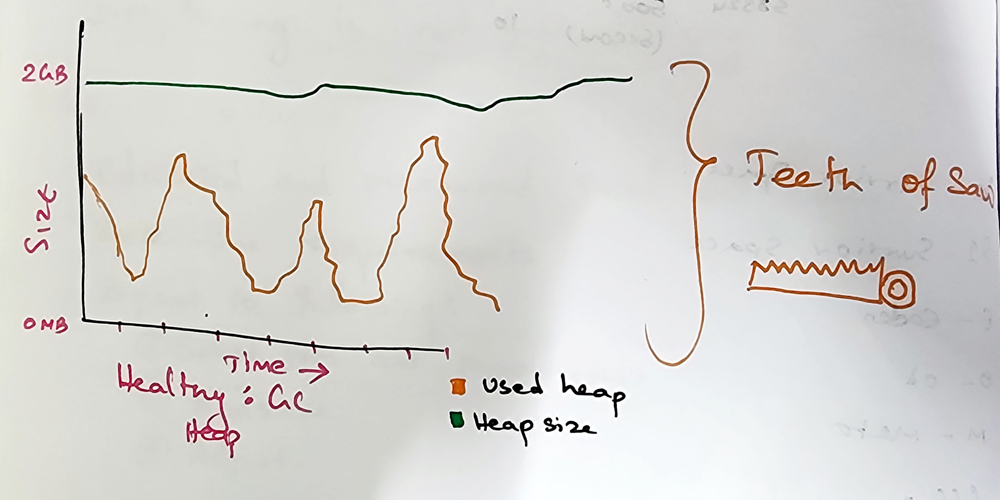
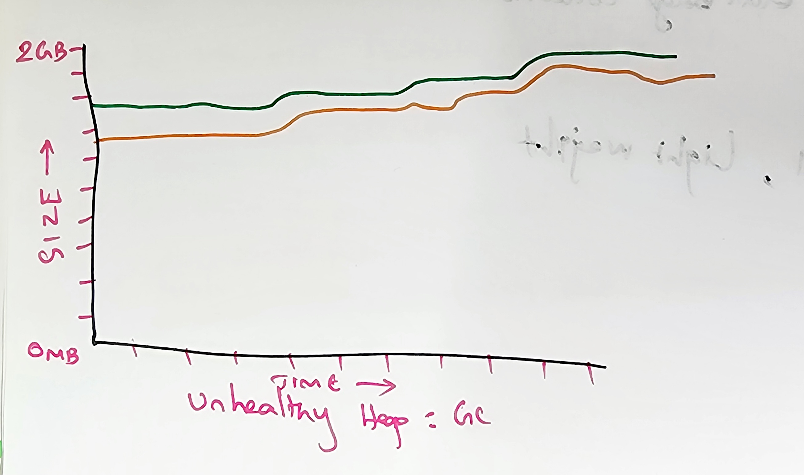

# Garbage Collection (GC)

--------------------------------------

Objects on the heap takes up spaces. We may not need all the objects created inside the heap.

To clean up the heap memory, JVM uses the **Garbage collection**. which removes the unused/un-referenced objects in the
heap memory.

## How to start GC?
We cannot force JVM to perform Garbage collection, rather we can **Suggest** the JVM to perform GC.
Only the JVM has the full control on GC, and it decides when to actually perform the GC.

```text
Only objects without relation to the stack can be garbage collected.
```

* GC it is expensive process
* Large no. of settings/parameters are available
* Chose the type of GC wisely (Based on the metrics, by trial and error)
* Many settings per type of GC(refer official docs for GC).

### Options for enabling specific GC for our program via parameters:

```text
1. -XX:+UseSerialGC
2. -XX:+UseParallelGC
3. -XX:+UseConcMarkSweepGC
4. -XX:+UseG1GC
5. -XX:+UseZGC
```

###Healthy GC:


###Un-Healthy GC:


###What is the default startup size of the metaspace?
```text
It typically doesn't have an initial size; its just uses what it needs and grow when it needs mode.
```

## Memory Leak:
Memory gets allocated, but does not deallocate which cause the memory leak. 
meaning when the object is created, and it is not cleaned up by the GC 
or by us (nullify or deallocate the object reference)
causing the Memory leak by increasing the memory usage.

Garbage collection can free-up the memory, but cannot do anything about the Memory Leak.
Which gives us the responsibility of managing the memory leak when we write code.

1. _Memory leak are caused because of **Poor coding standards** and not following the design principles._
2. _Static variables cause memory leak very much, try to avoid static variables, because static variables live until
the application is exited (i.e, It persists in memory until the Lifetime of java application)_
3. _Custom objects not having_ **equals**, **hashCode** _methods implemented within could cause memory leak as well._

    ### Tools:

    Memory leak can be monitored using Monitoring tools (Profiler, VisualVM etc).
    These tools can be used to analyze the JVM memory usage.

###How to detect Memory leak?
* App slows down (memory gets full) and need to be restarted.
* Not always a memory leak though
* Monitoring (Heap size, GC activity & Heap Dump will help us)

```text

    |------> Find the problem (Mem. Leak) ----->|
    |                                           |
    |<-----------  Fix the code <---------------|

Always loop the process to improve the application's GC and Memory Leak better.
```

```text
java -XX:+HeapDumpOnOutOfMemoryError -XX:HeapDumpPath=/home/tempuser/heapdump/hd1 JavaCompiledClassName
```

###How to open heap dump?
We can use tools like VisualVM or certain IDEs supports opening heapdump file.

###Common solution to avoid Memory Lead:

* Set the object to null in certain specific situations.
* Close resources such as stream and connections.
* Avoid string concat; rather use StringBuilder (string concat creates multiple new objects).
* Overwrite **hashCode** & **equals** method when creating custom own objects.

### Marking & Sweeping:

#### Types of Memory:
1. Young Generation
   1. Eden Space (For new objects)
   2. Survivor space (Objects here are ready to be garbage collected.)
2. Old Generation

###Different GCs:
  1. Serial GC
  2. Parallel GC
  3. Concurrent Mark Sweep (CMS GC)
  4. Garbage First (G1 GC) - Since Java 7
  5. Z GC - Since Java 15

  ####Serial GC:
   1. Young generation : **Mark & Copy**
   2. Old generation: **Mark sweep compact**
   3. Running on a Single thread
   4. Stop-the-world implementation

  ####Parallel GC:
   1. Young generation: **Mark & Copy**
   2. Old generation: **Mark sweep compact**
   3. Running on Multiple thread
   4. Stop-the-world implementation
   
  ####Concurrent mark sweep (CMS) GC:
   1. Young generation: **Mark, Copy & Stop-the-world**
   2. Old generation: **Mark sweep compact & Mostly concurrent**
   3. Running on Multiple thread.
   4. Stop-the-world, Mostly concurrent.

  ####Garbage First (G1) GC: (_Since Java 7_)
   1. Divide heap into small regions.
   2. Keeps track of amount of live and dead objects.
   3. Aims for shortest pauses possible.
   4. Running on Multiple threads.
   5. Concurrent and Stop-the-world.
   
  ####Z GC: (_Since Java 15_)
   1. Aims for maximum 10 milliseconds pause.
   2. Reference coloring
   3. Sweep and Copy
   4. Load barriers
   5. Running on Multiple thread
   6. Concurrent.

###Metrics of GC:

   * **Allocation rate**: How fast it is allocating object in the memory.
   * **Heap Population**: The amount of objects that is alive in the heap.
   * **Mutation rate**: How often references are updated in a memory.
   * **Object life span**: How long the objects typically live, One app may have mainly objects that die young.

   * **Mark time**: How long the GC needs to find all the live objects on the heap.
   * **Compaction time**: How long it takes GC to free-up all the space and reallocate the objects.

```text
GC cycle time is how long it takes the garbage collector to perform a full garbage collection, 
meaning checking all the objects on the heap and perform the gc.
```