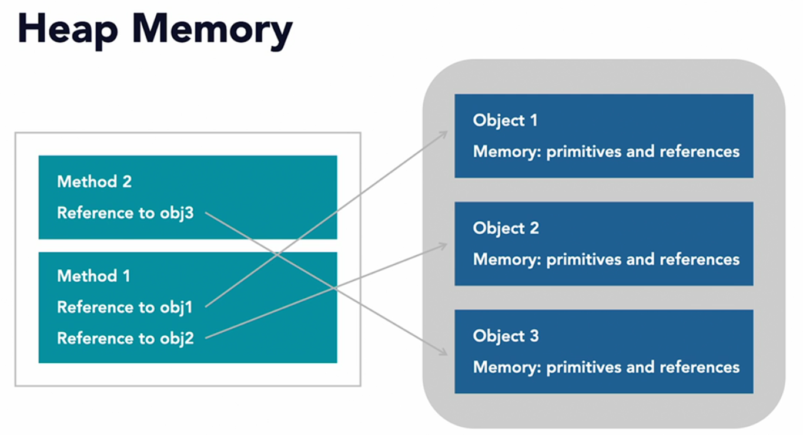
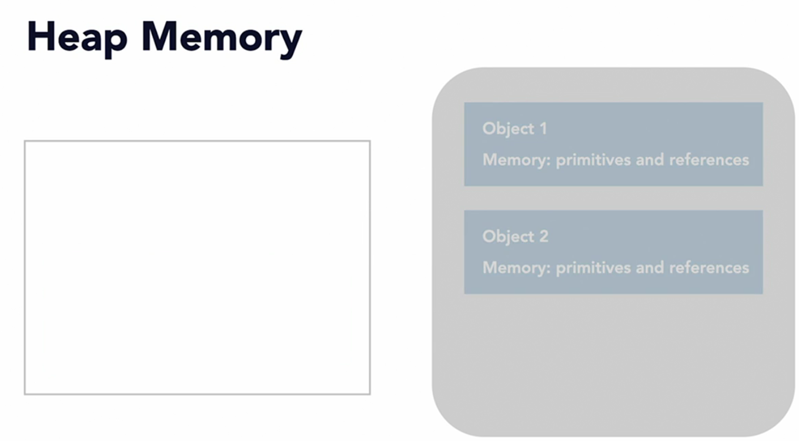

# Heap Memory

* Heap memory holds all the objects that exists in the application.
* Accessible from anywhere in the application using the address of the object (reference)
* Objects in the heap contains primitive values and reference of other object in the heap memory.

### Heap memory holds the objects which contains primitives and other object's reference.

### Heap Memory is cleared using Java Garbage Collector. 
The Garbage collector performs the clean-up of Heap Memory, until that the heap memory will
keep hold of the all the objects and references.

