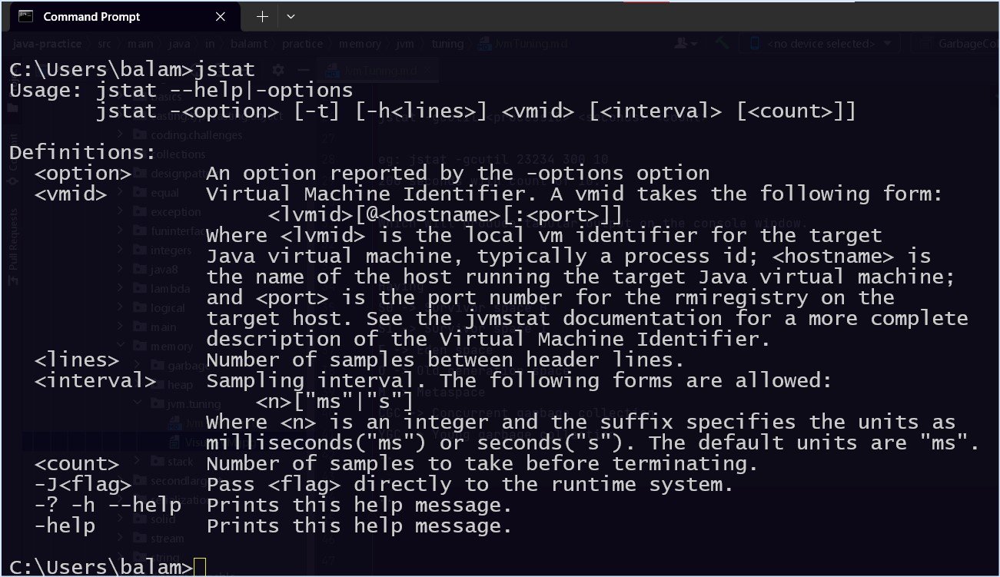
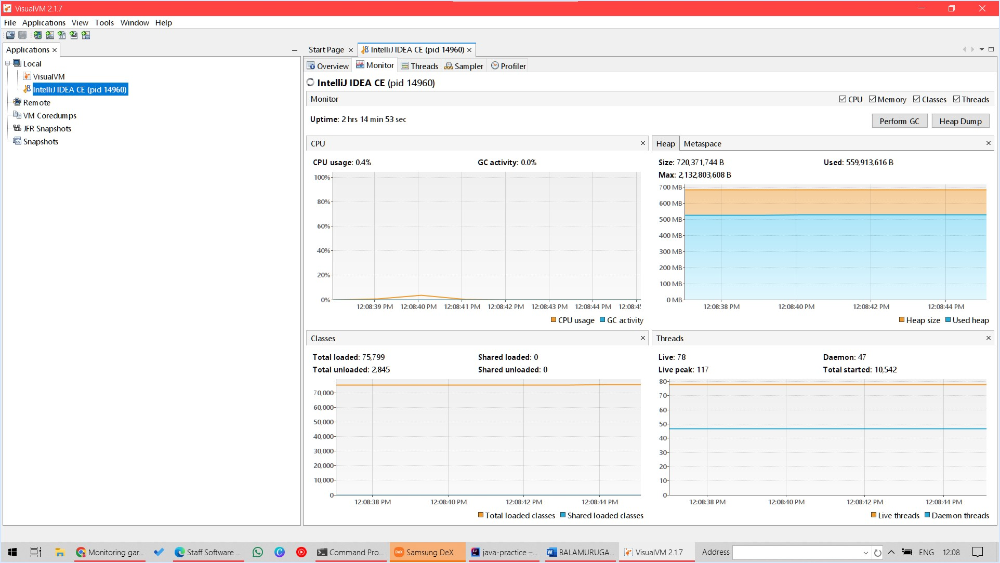

#JVM Tuning

### What is JVM Tuning?
   * Educated and measured, (using trial and error)
   * Determine requirements
   * Repeat the following:
     1. Select JVM and parameters
     2. Measure
     3. Adjust
     4. Repeat 1 - 4

### Questions to ask before we tune JVM:

1. Is the Memory functioning all right?
2. Is the latency all right?
3. Is the through-put normal?
     * High through-put means -> More memory and performance degrades.

### Tools used for capturing metrics:

####JStat (JVM Stats)

```text
Command line tool: jstat

jstat -gcutil <processID> <seconds> <count>

eg: jstat -gcutil 23234 300 10
200 seconds with count of 10.

Which will produce tabular output on the console window.


Having 
S0 -> Survivor space 0
S1 -> Survivor space 1
E -> Eden space
O -> Old generation space
M -> Metaspace
CGC -> Concurrent garbage collection
YGC -> Young garbage collection 
..
..
..
```



####Visual VM
 Lightweight, Visual tool to monitor and capture metrics of JVM.
 
