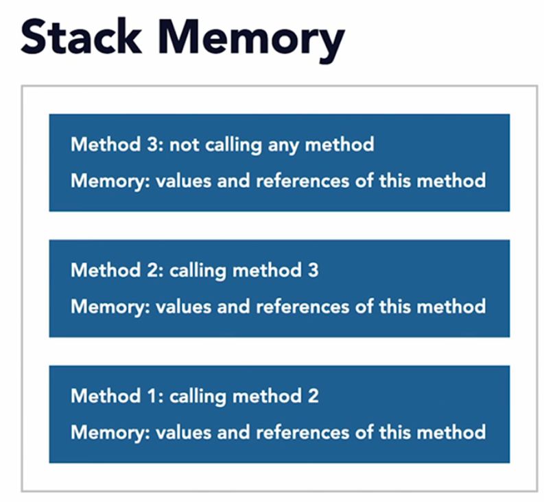

# Stack memory 

Stack memory are used for executing methods. (Method calls are arranged in stack.)
 
* Used for executing methods
* Contains primitives and object references of methods in the stack.
* When method is executed it is cleared from the stack automatically.
* each method has its own stack block.
* **We can expect StackOverFlow Error when stack memory is full.**

Example:

```java

void method1() {
        method2();
    }

void method2() {
        method3();
    }
void method3(){
        //do some operations
    }
```

---------------------

| STACK MEMORY |
|--------------|
| method3()    |
| method2()    |
| method1()    |

