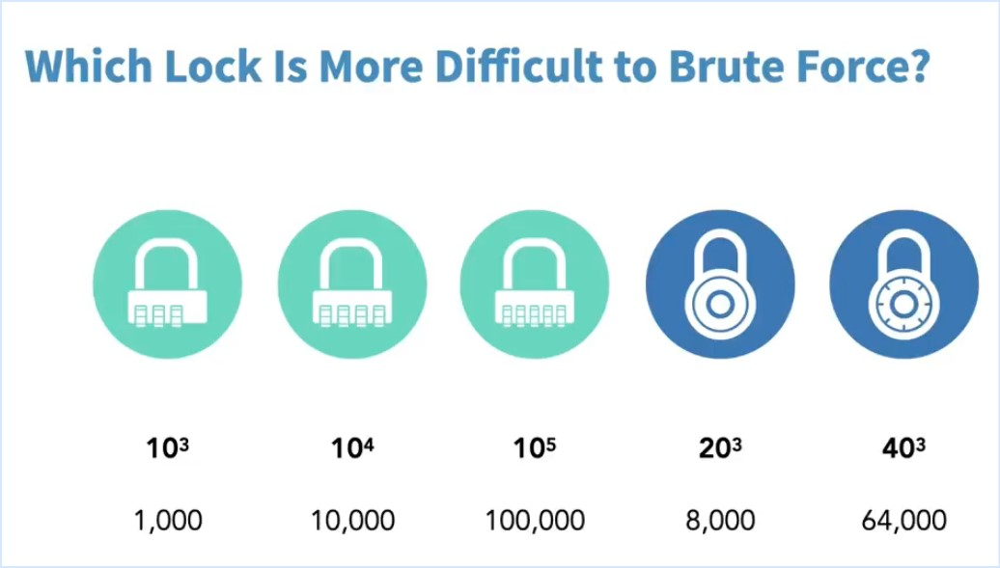

#Bruteforce Attacks

Software systematically generates rapid-fire input trying to guess the correct value of a password.

```text
Consider the three-wheel combination lock in brief-case.

the Combination range from 000 to 999

So it allows the attacker to try 000,001,002....,997,998,999. Trial and Error method.
This way the attacker gains access to open the brief-case.

Time required is depend on the combination range.

Key space=Possibilities^Keylength


```

